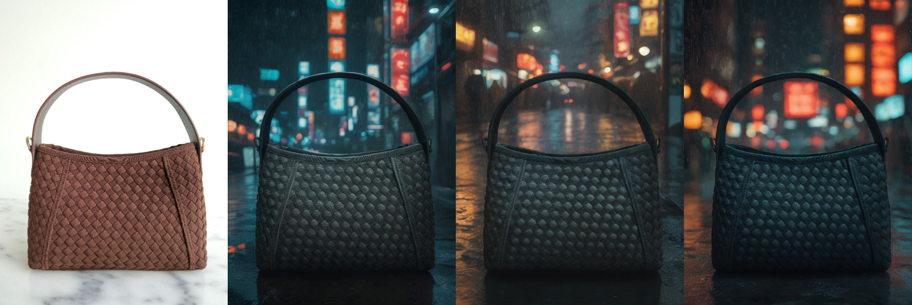
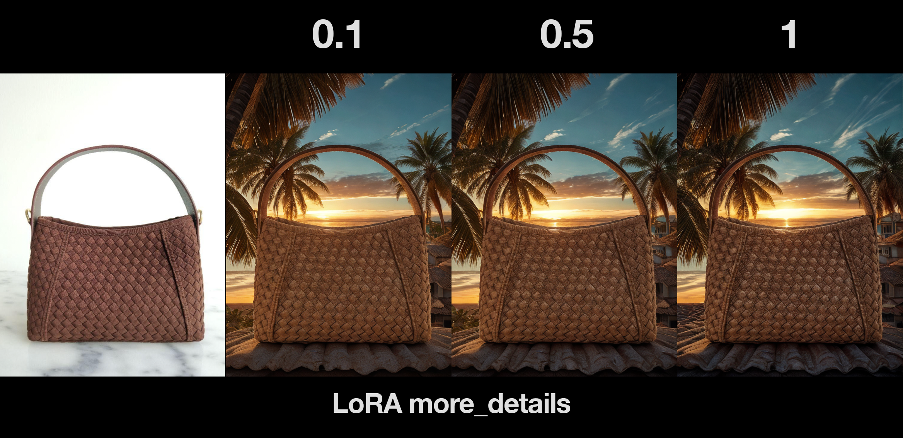
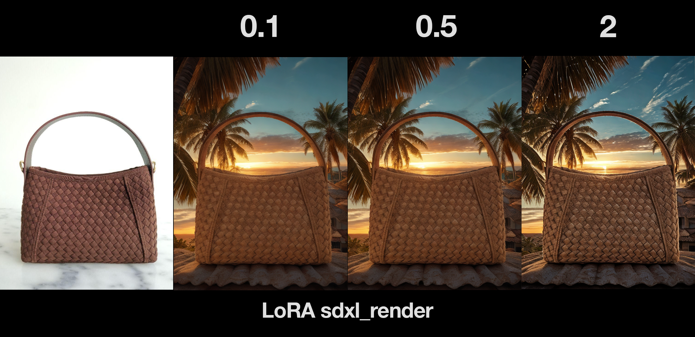
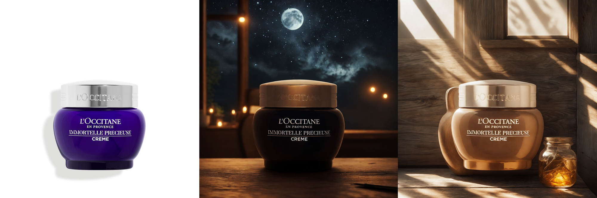

# ProdGen

### Overview
That technology consist 2 parts:
- RunScript
- Backend (Automatic1111)

RunScript receives an image and a prompt from the user and sends them to the Backend as JSON (with the image in base64 format).
The Backend takes the input (prompt and image), processes it with the given parameters, and returns the result.

Automatic1111 serves as the backbone for the playground: it offers many models, API documentation, and an active community. I also have experience working with it.
However, there are limitations due to API bugs, constraints, and, as a result of its flexibility, slower deployment and occasional inference delays.

ComfyUI is a solid alternative, so I believe there’s no issue with exploring it further and building similar processing and API functionality. However, my experience with ComfyUI has been limited to the UI only.


## ProdGen results example


<p align="center">Example with dark ambient color and env transformation</p>

## Installation
### Ubuntu without Docker (or WSL2)

Consider you have installed python 3.8+

##### Backend

```
$ chmod +x install_backend.sh && chmod +x download_weights.sh
$ ./install_backend.sh
$ ./download_weights.sh
$ cd stable-diffusion-webui
$ COMMANDLINE_ARGS="--api --xformers" bash ./webui.sh &
```
`install_backend.sh` and `webui.sh` will take some time: download all packages, weights, extensions and create **venv** inside `./stable-diffusion-webui` directory. After you will see a message with exposed service on ```http://127.0.0.1:7860```

##### RunScript

```
$ chmod +x create_venv.sh
$ ./create_venv.sh
$ source venv/bin/activate
```
`create_venv.sh` will create **venv** to allow `run.py` make requests to **backend**

If you have different ENV manager like Anaconda, you can just run
```
$ pip install -r requirements.txt
```

### Docker
To run this with full docker support (consider that you use a Nvidia GPU and drivers that [support Docker](https://docs.docker.com/compose/how-tos/gpu-support/). Also works with WSL2)

```
$ chmod +x download_weights_docker.sh && ./download_weights_docker.sh
$ docker-compose up
```

That command will prepare and run AUTOMATIC1111 in Docker with GPU support. Please, be patient, script will download CUDA image, torch, safetensors, etc. It will take some time.
After you will see a message with exposed service with ```http://127.0.0.1:7860```

After docker compose you need to complete **RunScript** procedure


## Run
Inside `RunScript` env


```
$ (venv) python run.py --input_path out.png --output_filename "outputs/run" --prompt "bag on the top of roof, sunny day, sunset and palms background"
```
Default output dir is `outputs/run`. If `output_filename` not set it will be with mask `DDMMYYYY-HHMMSS.png` 


### Run parameters

`input_path` - Input image to process

`output_filename` - Directory/path to file to save processed image

`prompt` - Prompt to be generated


`more_details` - LoRA to control generated details



`lora_sdxl_render` - LoRA to control cinematic style (kind of universal LUT)




#### Technical features and limitations

#### Floating objects:
- Manually point "what is it" and "where it is". 
  For example "A bag on the table". Assume that we have only one mask SD will generate what we expect (examples grid with random seed)
- Generate plane mask under the mask object. 
  For example, at the step when we get main object mask, we can calculate bottom boundary of object, so we can generate background with plane, then add the object with inpainting (shadows will appear), that apply IC light color correction to the whole scene
- Add special keywords to user prompt inside script 

#### "Cinematic" style
At this moment with IC Light we ofter gen too bright and saturated colors, like applied LUT tables
- We can change this with different pipeline and IMG2IMG processing, for example, without IC Light
- Merge/blend image with original masked input

#### Mask segmentation
Because mask segmentation is hidden step inside IC Light pipeline, we can't control this, so result my vary
- Implement different steps with explicit mask segmentation (select models to object segmentation / background remove) 
- Create another pipeline without IC light processing

#### Color translations
Sometimes we can lose color translation from original inputs. For example, blue can be black, or brown can be red with different lights
- Blend with original image
- Reduce IC Light impact with provided parameters
- Control colors with prompt and negative prompt


<p align="center">Example with loose colors</p>


<p align="center">Example with loose colors, ghosting (middle) and floating object (right). In this case we have input with slightly visible horizontal shadow that makes segmentation harder</p>

### Requirements
Minimal technical requirements 

8GB RAM, 16GB VRAM (10-12 VRAM with small images)

Tests with different image resolutions on 3090 GPU. 

| Resolution  | Memory Usage | Time   | Steps |
|-------------|--------------|--------|-------|
| 1300x2000   | 14.5GB       | 50sec  | 30    |
| 1200x1200   | 10GB         | 21sec  | 30    |
| 700x700     | 8.5GB        | 5sec   | 30    |

Tests made in WSL2. Memory usage on Linux systems will be 2-3 GB VRAM smaller 


##### TODO:

- [ ] Light control: position, type
- [ ] Outpainting implementation
- [ ] Upscaler
- [ ] Object segmentation control
- [ ] Cinematic / DSLR / Phone photo styles
- [ ] Implement sampler choice
- [ ] Batch processing
- [ ] Inference speedup
- [ ] Queue progress bar


